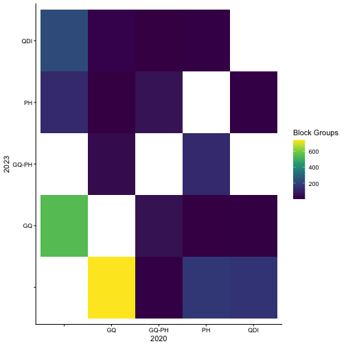
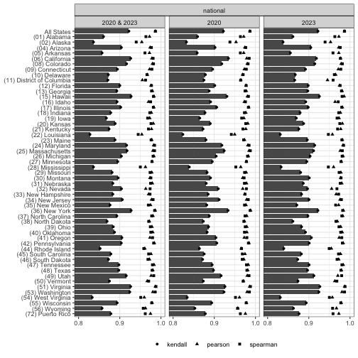
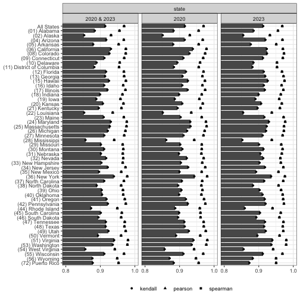
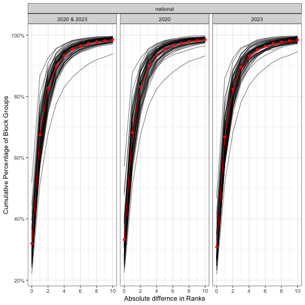
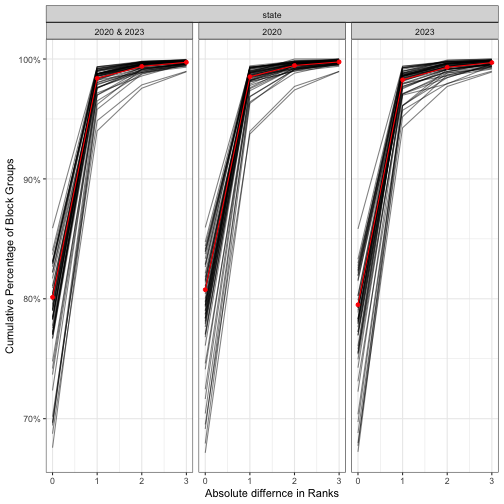
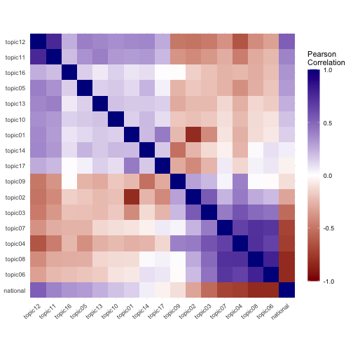

# FAIR Area Deprivation Index


The Area Deprivation Index (ADI)

* defined in Kind et.al. (2014) https://doi.org/10.7326/m13-2946

* A well referenced and commonly used source for the ADI is from [Neighborhood
  Atlas](https://www.neighborhoodatlas.medicine.wisc.edu/)

The work in this directory is an attempt to reproduce the ADI as published by
Neighborhood Atlas. The reproduction is called `fairadi`, a **FAIR**-compliant
(Findability, Accessibility, Interoperability, and Reuse) **ADI**.

In general, the ADI is defined at the United States Census Block Group level
using data from the American Community Survey Five-Year (ACS5) data.

| Topic  | Topic Area                                 | ACS5 Detailed Table ID   | Specific Variables / Calculation                                                                  |
| ---    | ------------                               | -------------------      | ----------------------------------                                                                |
| 1      | % Pop ≥ 25 yrs with < 9 yrs Education      | B15003                   | Numerator: Sum _002 to _012. Denominator: B15003_001                                              |
| 2      | % Pop ≥ 25 yrs with >= High School Diploma | B15003                   | Numerator: Sum _002 to _016. Denominator: B15003_001. 1 - (sum() / D)                             |
| 3      | % Employed ≥ 16 yrs in White-Collar Occs.  | C24010                   | Numerator: Sum _003 to _013 (Male) and _039 to _049 (Female). Denominator: C24010_001             |
| 4      | Median Household Income                    | B19013                   | Use B19013_001                                                                                    |
| 5      | Income Disparity (Singh Index)             | B19001                   | Numerator: B19001_002. Denominator: Sum B19001_011 to B19001_017. Calculate: log(100 × Num / Den) |
| 6      | Median Home Value                          | B25077                   | Use B25077_001                                                                                    |
| 7      | Median Gross Rent                          | B25064                   | Use B25064_001                                                                                    |
| 8      | Median Monthly Mortgage                    | B25088                   | Use B25088_001                                                                                    |
| 9      | Home Ownership Rate (% Owner-Occupied)     | B25003                   | Numerator: B25003_002. Denominator: B25003_001                                                    |
| 10     | Unemployment Rate (% Civilian Labor Force) | B23025                   | Numerator: B23025_005. Denominator: B23025_002                                                    |
| 11     | % Families Below Poverty Level             | B17010                   | Numerator: B17010_002. Denominator: B17010_001                                                    |
| 12     | % Pop Below 150% of Poverty Threshold      | C17002                   | Numerator: Sum _002 through _005. Denominator: C17002_001                                         |
| 13     | % One-Parent Households (Children < 18)    | B11003                   | Numerator: B11003_010 + B11003_016. Denominator: B11003_001                                       |
| 14     | % Households Without a Motor Vehicle       | B25044                   | Numerator: B25044_003 + B25044_010. Denominator: B25044_001                                       |
| 15-old | % Households Without a Telephone           | B25043                   | Numerator: B25043_004. Denominator: B25043_001                                                    |
| 15-new | % Households Without internet              | B28002                   | Numerator: B28002_013. Denominator: B28002_001                                                    |
| 16     | % Units Without Complete Plumbing          | B25047                   | Numerator: B25047_003. Denominator: B25047_001                                                    |
| 17     | % Crowding (> 1.00 Person Per Room)        | B25014                   | Numerator: Sum _005, _006, _011, _012. Denominator: B25014_001                                    |

The current `fairadi` build uses `B19013`, `B25064`, and `B25088` for topics
4, 7, and 8 respectively. These topic definitions improved agreement with
Neighborhood Atlas relative to the earlier `B19113`, `B25063`, and `B25087`
choices.

Two important year-availability caveats affect early ADI coverage:

- `B15003` is required for topics `01` and `02`, but in this workflow it is
  only available starting in `2012`.
- As a result, `2010` and `2011` cannot currently produce full ADI coverage and
  are expected to contain mostly `QDI` block groups rather than complete
  rankings.

Neighborhood Atlas also [uses block group suppression](https://www.neighborhoodatlas.medicine.wisc.edu/changelog#:~:text=Changes%20between%20versions%20of%20the%20ADI%2C%2011/19/2020)
before building the state and national rankings.

> Block group suppression: We have applied the same Diez Roux suppression
> criteria used in the earlier 2013 and 2015 builds: any block group with fewer
> than 100 persons, fewer than 30 housing units, or greater than 33% of the
> population living in group quarters will not receive an ADI ranking. In
> addition, we have suppressed of a small number of block groups which include
> those with survey errors acknowledged by the US Census Bureau.

Tables from the United States Census used to build the suppression criteria
include those from the ACS5 and from the Decennial census.  In particular,
grouped quarters are available at the block group level in the Decennial census
but are not available at the block group level, only the tract level, for the
ACS5 data.

| Topic            | Decennial Table | ACS5 Table |
| :----            | :----:          | :----:     |
| Total Population | P1              | B01003     |
| Group Quarters   | P18             |            |
| Housing Units    |                 | B25001     |

In `fairadi`, the group-quarters exclusion criterion uses Decennial 2020
block-group values for all modeled years. Public ACS 5-year data do not report
group-quarters counts at the block-group level, only at the tract level.
Because the suppression rule is defined at the block-group level, the 2020
Decennial Census is used as the public-data source that preserves the needed
geographic resolution. This means the group-quarters component of the
suppression rule is anchored to 2020 rather than varying annually.

## Workflow

In this directory there are R script for each of the ADI topics and one for
building the ADI score and rankings.

## Diagnostics of the Reproduction

### Neighborhood Atlas Data

You will need to get your own copy of the [Neighborhood
Atlas](https://www.neighborhoodatlas.medicine.wisc.edu/)
data sets. They are for public use.  However, Neighborhood Atlas asks that you
create an account with them before downloading the data.

Two files were used in this work:

- neighborhood-atlas-2020-adi-v4_0_1.csv
  - 2020 Area Deprivation Index v4.0.1.
  - University of Wisconsin School of Medicine and Public Health.
  - Downloaded from https://www.neighborhoodatlas.medicine.wisc.edu/
  - March 20 2026
  - SHA256: 8c575a7ff78cacde1d9d7dfd644d36bc49bf2a9992029ae17e3e35be8c283adc

- neighborhood-atlas-2023-adi-v4_0_1.csv
  - 2023 Area Deprivation Index v4.0.1.
  - University of Wisconsin School of Medicine and Public Health.
  - Downloaded from https://www.neighborhoodatlas.medicine.wisc.edu/
  - March 20 2026
  - SHA256: 396d02228b13f6ae45196d416218e69889696aa99c14730aad631adb8659b08b


Import the Neighborhood Atlas 2020 and 2023 data.


### `fairadi` Data
Read in the `fairadi` data.

``` r
fairadi <- data.table::fread("fairadi.csv.gz", colClasses = c("FIPS" = "character"))
str(fairadi)
## Classes 'data.table' and 'data.frame':	2974263 obs. of  11 variables:
##  $ year                : int  2012 2012 2012 2012 2012 2012 2012 2012 2012 2012 ...
##  $ state               : int  1 1 1 1 1 1 1 1 1 1 ...
##  $ county              : int  1 1 1 1 1 1 1 1 1 1 ...
##  $ tract               : int  20100 20100 20200 20200 20300 20300 20400 20400 20400 20400 ...
##  $ block_group         : int  1 2 1 2 1 2 1 2 3 4 ...
##  $ FIPS                : chr  "010010201001" "010010201002" "010010202001" "010010202002" ...
##  $ adi_raw             : num  -13741 -13742 -12898 -12898 -12252 ...
##  $ exclude_from_ranking: int  0 0 0 0 0 0 0 0 0 0 ...
##  $ exclude_reason      : chr  "" "" "" "" ...
##  $ national_rank       : int  63 63 67 67 70 73 52 59 65 65 ...
##  $ state_rank          : int  3 3 4 4 4 5 2 3 4 4 ...
##  - attr(*, ".internal.selfref")=<externalptr>
```


### Exclusion Criteria
As noted above, Neighborhood Atlas does exclude some block groups from ranking.  
Here we report how similar our exclusion flagging is.

<table>
 <thead>
  <tr>
   <th style="text-align:left;"> fairadi </th>
   <th style="text-align:left;"> Neighborhood Atlas </th>
   <th style="text-align:right;"> Number of Block Groups </th>
  </tr>
 </thead>
<tbody>
  <tr grouplength="4"><td colspan="3" style="border-bottom: 1px solid;"><strong>2020</strong></td></tr>
<tr>
   <td style="text-align:left;padding-left: 2em;" indentlevel="1"> Include </td>
   <td style="text-align:left;"> Include </td>
   <td style="text-align:right;"> 235329 </td>
  </tr>
  <tr>
   <td style="text-align:left;padding-left: 2em;" indentlevel="1"> Include </td>
   <td style="text-align:left;"> Exclude </td>
   <td style="text-align:right;"> 773 </td>
  </tr>
  <tr>
   <td style="text-align:left;padding-left: 2em;" indentlevel="1"> Exclude </td>
   <td style="text-align:left;"> Include </td>
   <td style="text-align:right;"> 557 </td>
  </tr>
  <tr>
   <td style="text-align:left;padding-left: 2em;" indentlevel="1"> Exclude </td>
   <td style="text-align:left;"> Exclude </td>
   <td style="text-align:right;"> 5676 </td>
  </tr>
  <tr grouplength="4"><td colspan="3" style="border-bottom: 1px solid;"><strong>2023</strong></td></tr>
<tr>
   <td style="text-align:left;padding-left: 2em;" indentlevel="1">  </td>
   <td style="text-align:left;"> Exclude </td>
   <td style="text-align:right;"> 40 </td>
  </tr>
  <tr>
   <td style="text-align:left;padding-left: 2em;" indentlevel="1"> Include </td>
   <td style="text-align:left;"> Include </td>
   <td style="text-align:right;"> 236102 </td>
  </tr>
  <tr>
   <td style="text-align:left;padding-left: 2em;" indentlevel="1"> Include </td>
   <td style="text-align:left;"> Exclude </td>
   <td style="text-align:right;"> 26 </td>
  </tr>
  <tr>
   <td style="text-align:left;padding-left: 2em;" indentlevel="1"> Exclude </td>
   <td style="text-align:left;"> Exclude </td>
   <td style="text-align:right;"> 6168 </td>
  </tr>
</tbody>
</table>


There are 40 GEOIDs in the 2023 Neighborhood Atlas only.
- In the 2023 Neighborhood Atlas file, all 40 are marked QDI for both
  ADI_NATRANK and ADI_STATERNK.
- Those same GEOIDs existed in local Census-derived outputs for earlier
  years:
   - present in FIPS/2022__block_groups.csv
   - present in ADI/fairadi.csv.gz for 2020 to 2022
- They are absent from the 2023 Census geography inventory you are building from:
   - absent from FIPS/2023__block_groups.csv
   - their parent tracts are also absent from FIPS/2023__tracts.csv

The 40 GEOIDs are concentrated in 15 tracts:

- 14 tracts in Suffolk County, NY
- 1 tract in Ulster County, NY

Examples:

- 361031224061 to 361031224064 are in Census Tract 1224.06, Suffolk County
- 361031460011 to 361031460012 are in Census Tract 1460.01, Suffolk County
- 361119544011 is in Census Tract 9544.01, Ulster County

What that means:

- Neighborhood Atlas kept these GEOIDs in its 2023 file as QDI placeholders.
- Your Census-based build only includes geographies that are returned by the
  current Census files for that year.
- So for 2023, these 40 GEOIDs drop out of your build because they are no longer
  in the Census geography inventory you are using.

So the reason for the mismatch is a geography-vintage mismatch between
Neighborhood Atlas 2023 and the 2023 Census geography returned by the fairadi workflow.


``` r
exin <-
  deltas[!is.na(exclude_from_ranking),
    .(
      both_exclude = qwraps2::n_perc(exclude_from_ranking == 1 & neighborhood_atlas_exclude == 1, digits = 1),
      both_include = qwraps2::n_perc(exclude_from_ranking == 0 & neighborhood_atlas_exclude == 0, digits = 1),
      in_fairadi_ngbr_ex = qwraps2::n_perc(exclude_from_ranking == 0 & neighborhood_atlas_exclude == 1, digits = 1),
      ex_fairadi_nghr_in = qwraps2::n_perc(exclude_from_ranking == 1 & neighborhood_atlas_exclude == 0, digits = 1)
    ),
    keyby = .(year)
  ]
```

<table>
 <thead>
  <tr>
   <th style="text-align:right;"> Year </th>
   <th style="text-align:left;"> Excluded in Both </th>
   <th style="text-align:left;"> Included in Both </th>
   <th style="text-align:left;"> In fairadi; Excluded from Neighborhood Atlas </th>
   <th style="text-align:left;"> Excluded from fairadi; Included in Neighborhood Atlas </th>
  </tr>
 </thead>
<tbody>
  <tr>
   <td style="text-align:right;"> 2020 </td>
   <td style="text-align:left;"> 5,676 (2.3%) </td>
   <td style="text-align:left;"> 235,329 (97.1%) </td>
   <td style="text-align:left;"> 773 (0.3%) </td>
   <td style="text-align:left;"> 557 (0.2%) </td>
  </tr>
  <tr>
   <td style="text-align:right;"> 2023 </td>
   <td style="text-align:left;"> 6,168 (2.5%) </td>
   <td style="text-align:left;"> 236,102 (97.4%) </td>
   <td style="text-align:left;"> 26 (0.0%) </td>
   <td style="text-align:left;"> 0 (0.0%) </td>
  </tr>
</tbody>
</table>


```
## Key: <year, neighborhood_atlas_exclude_reason>
##     year neighborhood_atlas_exclude_reason     N
##    <int>                            <char> <int>
## 1:  2020                                GQ   751
## 2:  2020                               QDI    22
## 3:  2023                               QDI    26
```
The primary reason for exclusion by Neighborhood Atlas is group quarters, 751/799 (93.99%).

If the exclusion by group quarters is based on the Decennial census values, then
a block group should be excluded in both 2020 and 2023.  However, no block group
is excluded from the Neighborhood Atlas rankings due to group quarters in both
2020 and 2023.


There are many ways the reason for exclusion will change from 2020 to 2023
within the Neighborhood Atlas data.
<div class="figure" style="text-align: center">

<p class="caption">Block group exclusion reason by year for Neighborhood Atlas data.  GQ: group quarters, PH: total population, QDI: questionable data quality, blank: included in that years rankings.</p>
</div>
We speculate that the reason the exclusion based on group quarters changes from
2020 to 2023 within the Neighborhood Atlas data is that they have access to the
non-public ACS5 block group level data.  That data can be acquired with a signed
data-use agreement.  For the reproduction, and using only publicly available
data, we are restricted to using the Decennial census values for both 2020 and
2023.

### Rank Correlations


<div class="figure" style="text-align: center">

<p class="caption">plot of chunk correlation-plot-national</p>
</div>

<div class="figure" style="text-align: center">

<p class="caption">plot of chunk correlation-plot-state</p>
</div>

<table>
 <thead>
<tr>
<th style="empty-cells: hide;border-bottom:hidden;" colspan="1"></th>
<th style="border-bottom:hidden;padding-bottom:0; padding-left:3px;padding-right:3px;text-align: center; " colspan="3"><div style="border-bottom: 1px solid #ddd; padding-bottom: 5px; ">State Level</div></th>
<th style="border-bottom:hidden;padding-bottom:0; padding-left:3px;padding-right:3px;text-align: center; " colspan="3"><div style="border-bottom: 1px solid #ddd; padding-bottom: 5px; ">National Level</div></th>
</tr>
  <tr>
   <th style="text-align:left;"> Year(s) </th>
   <th style="text-align:right;"> Spearman </th>
   <th style="text-align:right;"> Pearson </th>
   <th style="text-align:right;"> Kendall </th>
   <th style="text-align:right;"> Spearman </th>
   <th style="text-align:right;"> Pearson </th>
   <th style="text-align:right;"> Kendall </th>
  </tr>
 </thead>
<tbody>
  <tr>
   <td style="text-align:left;"> 2020 &amp; 2023 </td>
   <td style="text-align:right;"> 0.9808 </td>
   <td style="text-align:right;"> 0.9808 </td>
   <td style="text-align:right;"> 0.9467 </td>
   <td style="text-align:right;"> 0.9924 </td>
   <td style="text-align:right;"> 0.9924 </td>
   <td style="text-align:right;"> 0.9552 </td>
  </tr>
  <tr>
   <td style="text-align:left;"> 2020 </td>
   <td style="text-align:right;"> 0.9819 </td>
   <td style="text-align:right;"> 0.9819 </td>
   <td style="text-align:right;"> 0.9490 </td>
   <td style="text-align:right;"> 0.9927 </td>
   <td style="text-align:right;"> 0.9927 </td>
   <td style="text-align:right;"> 0.9563 </td>
  </tr>
  <tr>
   <td style="text-align:left;"> 2023 </td>
   <td style="text-align:right;"> 0.9797 </td>
   <td style="text-align:right;"> 0.9797 </td>
   <td style="text-align:right;"> 0.9444 </td>
   <td style="text-align:right;"> 0.9922 </td>
   <td style="text-align:right;"> 0.9922 </td>
   <td style="text-align:right;"> 0.9542 </td>
  </tr>
</tbody>
</table>


<div class="figure" style="text-align: center">

<p class="caption">Cumulative percentage of block groups with differences in national percentile ranking between fairadi and Neighborhood Atlas.  Each black line is an individual state/territory, and the red line with dots is for the whole dataset.</p>
</div>

<div class="figure" style="text-align: center">

<p class="caption">Cumulative percentage of block groups with differences in national percentile ranking between fairadi and Neighborhood Atlas.  Each black line is an individual state/territory, and the red line with dots is for the whole dataset.</p>
</div>

```
## [1] "Cumulative percentage of block groups with differences in state decile ranking between fairadi and Neighborhood Atlas.  Each black line is an individual state/territory, and the red line with dots is for the whole dataset."
```

<table>
 <thead>
<tr>
<th style="empty-cells: hide;border-bottom:hidden;" colspan="1"></th>
<th style="border-bottom:hidden;padding-bottom:0; padding-left:3px;padding-right:3px;text-align: center; " colspan="4"><div style="border-bottom: 1px solid #ddd; padding-bottom: 5px; ">State Level Deciles</div></th>
<th style="border-bottom:hidden;padding-bottom:0; padding-left:3px;padding-right:3px;text-align: center; " colspan="11"><div style="border-bottom: 1px solid #ddd; padding-bottom: 5px; ">National Level Percentiles</div></th>
</tr>
<tr>
<th style="empty-cells: hide;border-bottom:hidden;" colspan="1"></th>
<th style="empty-cells: hide;border-bottom:hidden;" colspan="1"></th>
<th style="border-bottom:hidden;padding-bottom:0; padding-left:3px;padding-right:3px;text-align: center; " colspan="3"><div style="border-bottom: 1px solid #ddd; padding-bottom: 5px; ">Within</div></th>
<th style="empty-cells: hide;border-bottom:hidden;" colspan="1"></th>
<th style="border-bottom:hidden;padding-bottom:0; padding-left:3px;padding-right:3px;text-align: center; " colspan="10"><div style="border-bottom: 1px solid #ddd; padding-bottom: 5px; ">Within</div></th>
</tr>
  <tr>
   <th style="text-align:left;"> Year(s) </th>
   <th style="text-align:right;"> Equal </th>
   <th style="text-align:right;"> 1 </th>
   <th style="text-align:right;"> 2 </th>
   <th style="text-align:right;"> 3 </th>
   <th style="text-align:right;"> Equal </th>
   <th style="text-align:right;"> 1 </th>
   <th style="text-align:right;"> 2 </th>
   <th style="text-align:right;"> 3 </th>
   <th style="text-align:right;"> 4 </th>
   <th style="text-align:right;"> 5 </th>
   <th style="text-align:right;"> 6 </th>
   <th style="text-align:right;"> 7 </th>
   <th style="text-align:right;"> 8 </th>
   <th style="text-align:right;"> 9 </th>
   <th style="text-align:right;"> 10 </th>
  </tr>
 </thead>
<tbody>
  <tr>
   <td style="text-align:left;"> 2020 &amp; 2023 </td>
   <td style="text-align:right;"> 0.8013 </td>
   <td style="text-align:right;"> 0.9839 </td>
   <td style="text-align:right;"> 0.9939 </td>
   <td style="text-align:right;"> 0.9973 </td>
   <td style="text-align:right;"> 0.3200 </td>
   <td style="text-align:right;"> 0.6748 </td>
   <td style="text-align:right;"> 0.8272 </td>
   <td style="text-align:right;"> 0.8986 </td>
   <td style="text-align:right;"> 0.9343 </td>
   <td style="text-align:right;"> 0.9541 </td>
   <td style="text-align:right;"> 0.9656 </td>
   <td style="text-align:right;"> 0.9733 </td>
   <td style="text-align:right;"> 0.9787 </td>
   <td style="text-align:right;"> 0.9823 </td>
   <td style="text-align:right;"> 0.9851 </td>
  </tr>
  <tr>
   <td style="text-align:left;"> 2020 </td>
   <td style="text-align:right;"> 0.8076 </td>
   <td style="text-align:right;"> 0.9852 </td>
   <td style="text-align:right;"> 0.9946 </td>
   <td style="text-align:right;"> 0.9976 </td>
   <td style="text-align:right;"> 0.3318 </td>
   <td style="text-align:right;"> 0.6816 </td>
   <td style="text-align:right;"> 0.8314 </td>
   <td style="text-align:right;"> 0.9012 </td>
   <td style="text-align:right;"> 0.9365 </td>
   <td style="text-align:right;"> 0.9559 </td>
   <td style="text-align:right;"> 0.9671 </td>
   <td style="text-align:right;"> 0.9745 </td>
   <td style="text-align:right;"> 0.9795 </td>
   <td style="text-align:right;"> 0.9829 </td>
   <td style="text-align:right;"> 0.9855 </td>
  </tr>
  <tr>
   <td style="text-align:left;"> 2023 </td>
   <td style="text-align:right;"> 0.7950 </td>
   <td style="text-align:right;"> 0.9827 </td>
   <td style="text-align:right;"> 0.9931 </td>
   <td style="text-align:right;"> 0.9970 </td>
   <td style="text-align:right;"> 0.3083 </td>
   <td style="text-align:right;"> 0.6679 </td>
   <td style="text-align:right;"> 0.8230 </td>
   <td style="text-align:right;"> 0.8961 </td>
   <td style="text-align:right;"> 0.9322 </td>
   <td style="text-align:right;"> 0.9523 </td>
   <td style="text-align:right;"> 0.9642 </td>
   <td style="text-align:right;"> 0.9722 </td>
   <td style="text-align:right;"> 0.9779 </td>
   <td style="text-align:right;"> 0.9817 </td>
   <td style="text-align:right;"> 0.9847 </td>
  </tr>
</tbody>
</table>


<div class="figure" style="text-align: center">

<p class="caption">Pearson correlation between each of the ADI topics and the fairadi National Percentile Ranking</p>
</div>

## Session Info


``` r
sessionInfo()
## R version 4.5.3 (2026-03-11)
## Platform: x86_64-apple-darwin20
## Running under: macOS Sonoma 14.8.3
## 
## Matrix products: default
## BLAS:   /Library/Frameworks/R.framework/Versions/4.5-x86_64/Resources/lib/libRblas.0.dylib 
## LAPACK: /Library/Frameworks/R.framework/Versions/4.5-x86_64/Resources/lib/libRlapack.dylib;  LAPACK version 3.12.1
## 
## locale:
## [1] en_US.UTF-8/en_US.UTF-8/en_US.UTF-8/C/en_US.UTF-8/en_US.UTF-8
## 
## time zone: America/Denver
## tzcode source: internal
## 
## attached base packages:
## [1] stats     graphics  grDevices utils     datasets  methods   base     
## 
## loaded via a namespace (and not attached):
##  [1] gtable_0.3.6        dplyr_1.2.1         compiler_4.5.3     
##  [4] tidyselect_1.2.1    Rcpp_1.1.1          xml2_1.5.2         
##  [7] stringr_1.6.0       systemfonts_1.3.2   scales_1.4.0       
## [10] textshaping_1.0.5   ggh4x_0.3.1         fastmap_1.2.0      
## [13] ggplot2_4.0.2       R6_2.6.1            labeling_0.4.3     
## [16] generics_0.1.4      pcaPP_2.0-5         knitr_1.51         
## [19] kableExtra_1.4.0    tibble_3.3.1        svglite_2.2.2      
## [22] pillar_1.11.1       RColorBrewer_1.1-3  qwraps2_0.6.2      
## [25] R.utils_2.13.0      rlang_1.2.0         stringi_1.8.7      
## [28] xfun_0.57           S7_0.2.1            otel_0.2.0         
## [31] viridisLite_0.4.3   cli_3.6.5           withr_3.0.2        
## [34] magrittr_2.0.5      digest_0.6.39       grid_4.5.3         
## [37] mvtnorm_1.3-6       rstudioapi_0.18.0   lifecycle_1.0.5    
## [40] R.methodsS3_1.8.2   R.oo_1.27.1         vctrs_0.7.2        
## [43] evaluate_1.0.5      glue_1.8.0          data.table_1.18.2.1
## [46] farver_2.1.2        rmarkdown_2.31      tools_4.5.3        
## [49] pkgconfig_2.0.3     htmltools_0.5.9
```
