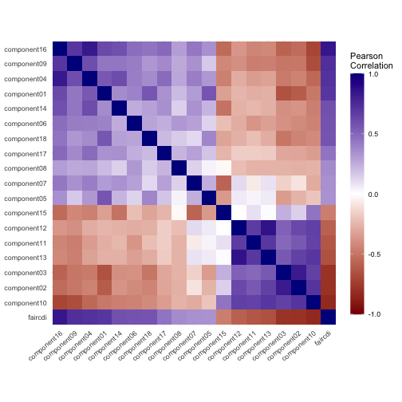

# Community Deprivation Index


This directory contains an in-progress implementation of the Community
Deprivation Index (CDI) based on the TEAM CDI specification tracked in
[`2025-08-28-team-cdi-calculation-specifications.pdf`](./2025-08-28-team-cdi-calculation-specifications.pdf).

The current build uses public ACS 5-year data already extracted elsewhere in
the repository and produces:

- `component01.csv.gz` through `component18.csv.gz`
- `total_population_and_housing_units.csv.gz`
- `faircdi.csv.gz`

## CDI Components

| Component | Description                                                 |
| :--:      | :--                                                         |
| 1         | 12 years or less of education, no diploma, %                |
| 2         | 16+ years of schooling, %                                   |
| 3         | Employed in white collar jobs, %                            |
| 4         | Families living below 100% of the federal poverty line, %   |
| 5         | Crowding (households with more than 1 person per room), %   |
| 6         | Households without high-speed internet, %                   |
| 7         | Households with no vehicle, %                               |
| 8         | Households with incomplete plumbing, %                      |
| 9         | Income disparity                                            |
| 10        | Median household income ($)                                 |
| 11        | Median gross rent ($)                                       |
| 12        | Median home value ($)                                       |
| 13        | Median monthly mortgage ($)                                 |
| 14        | One-parent households, %                                    |
| 15        | Owner occupied housing, %                                   |
| 16        | Population living below 150% of the federal poverty line, % |
| 17        | Unemployed, %                                               |
| 18        | Uninsured, %                                                |

## Process

The implementation follows the specification’s Step 1 through Step 9 workflow.

### Step 1: Component values

Each `componentXX.R` script imports the required ACS table and computes the
component value for all geographies present in the source extracts:

- census block group
- census tract
- county
- state

Most components are proportions. Component 9 is a ratio. Components 10 to 13
are medians.

### Step 2: Margins of error

`cdi_utilities.R` provides `steps_1_and_2()` for the shared MOE logic:

- single-item components use the ACS MOE directly
- proportions use the standard proportion MOE formula
- ratio components use the alternate formula when needed

The CDI implementation keeps most component values on the proportion scale
rather than multiplying by 100. MOEs are kept on the same scale as the
component values.

### Step 3: Flag values for replacement

`total_population_and_housing_units.R` builds
`total_population_and_housing_units.csv.gz`, which precomputes the shared Step 3
replacement flag for block groups with:

- total population `< 100`
- housing units `< 30`

Most components then combine that shared flag with any component-specific
invalid-value conditions, such as:

- denominator equal to zero
- invalid ACS estimate annotations

Median components 10 to 13 preserve the Census default open-ended median values
(`+/- 1`) and only flag the `"-"` estimate case for replacement.

### Step 4 and Step 5: Shrinkage and replacement

`cdi_utilities.R` provides `steps_4_and_5()` for the standard CDI shrinkage and
higher-geography replacement path.

Current implementation notes:

- flagged values are excluded from the block-group shrinkage-factor calculation
- if the local standard error or inter-geography variance is missing or zero,
  the shrinkage weight defaults to `1`, preserving the local value
- block-group values flagged for replacement are then coalesced upward through
  tract and county values

### Special handling for Component 9

`component09.R` does not call `steps_4_and_5()` directly.

The TEAM CDI specification treats income disparity differently:

- numerator `0` means no low-income households
- denominator `0` means no high-income households
- those cases use the minimum or maximum block-group disparity ratio rather
  than higher-geography replacement

The min/max disparity bounds are derived from block groups with non-zero
numerator and denominator. Low-population and low-housing replacement flags are
still applied through `total_population_and_housing_units.csv.gz`.

### Step 6: Standardize components

Each component script standardizes the final block-group component values within
year:

These standardized block-group values are the inputs to the CDI PCA step.

### Step 7: Principal component analysis

`faircdi.R` merges the 18 standardized component files and runs `stats::prcomp`
separately by year.

The raw CDI score is calculated from the first principal component weights. The
implementation explicitly orients the first component so higher CDI values mean
higher deprivation:

- `deprivation_components` components are expected to increase with deprivation
- `affuluence_components` components are protective / affluence measures
- the first loading vector is multiplied by `-1` if needed so the grouped
  direction is consistent with deprivation


``` r
deprivation_components
```

```
##  [1] "component01" "component04" "component05" "component06" "component07"
##  [6] "component08" "component09" "component14" "component16" "component17"
## [11] "component18"
```

``` r
affluence_components
```

```
## [1] "component02" "component03" "component10" "component11" "component12"
## [6] "component13" "component15"
```


### Step 8: Standardized CDI score

`faircdi.R` rescales the raw CDI score to:

- mean `100`
- standard deviation `20`

within each year.

### Step 9: National percentile ranking

`faircdi.R` converts the CDI score to a national percentile ranking from `1` to
`100` within year. Higher values indicate higher deprivation relative to other
block groups.

## Output Columns

`faircdi.csv.gz` currently includes:

- `year`
- `FIPS`
- `cdiraw`
- `cdistd`
- `faircdi`

## Summary Statistics





